# 📊 Automated Data Pipeline using AWS (EC2, S3, Python)

This project automates a complete **ETL pipeline** using AWS and Python to clean, analyze, and store sales data.

## ✅ Objective

- 📥 Ingest raw sales data (CSV)
- 🧹 Clean and process data with Python
- 📈 Generate insights: top items, revenue, trends
- 💾 Save output as Excel and upload to S3
- 📈 Automating the entire ETL (Extract, Transform, Load) process.


## 🧰 Technologies Used

| Technology       | Purpose                                |
|------------------|----------------------------------------|
| AWS EC2          | Host Python script                     |
| AWS S3           | Store raw & processed data             |
| Pandas           | Data cleaning and transformation       |
| Boto3            | Connect Python with AWS services       |
| XlsxWriter       | Export processed data to Excel         |

## 🖼️ Screenshots

### VPC Dashboard
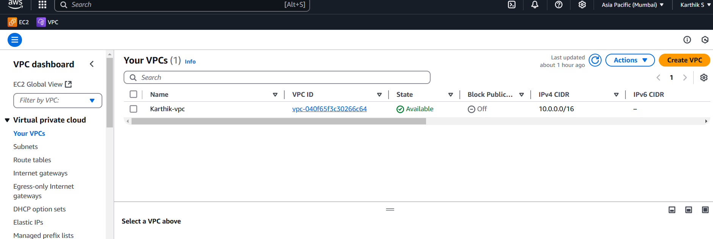

### EC2 Instance
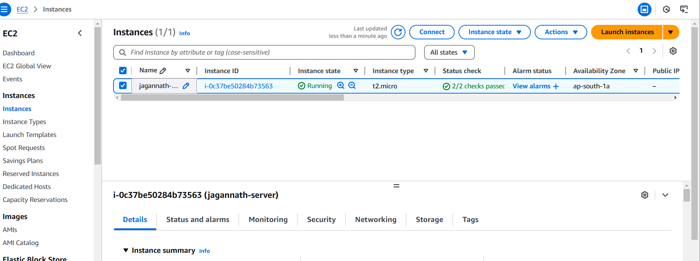

### S3 Bucket
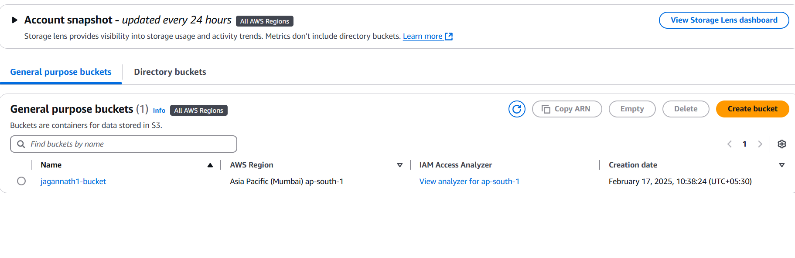

### S3 Bucket folders
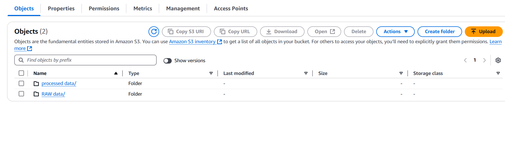

### Raw Data folder
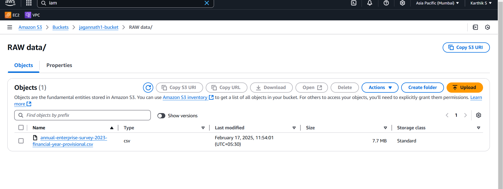

### Processed Data Folder
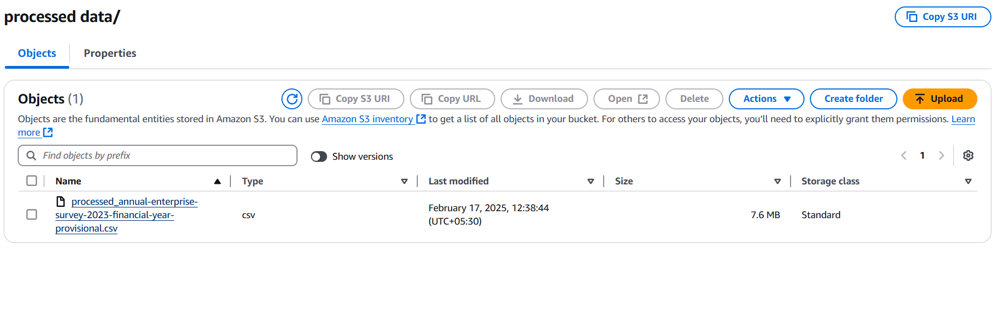

### IAM Role Setup
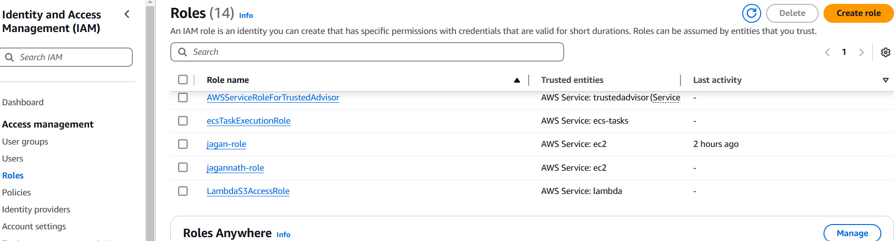

### Terminal Session
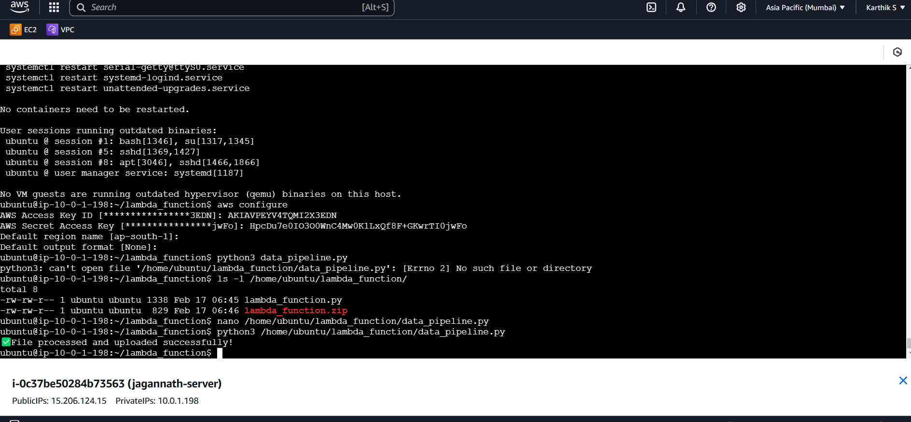

### History of commands
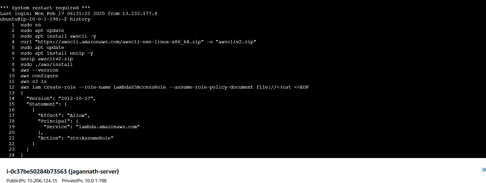
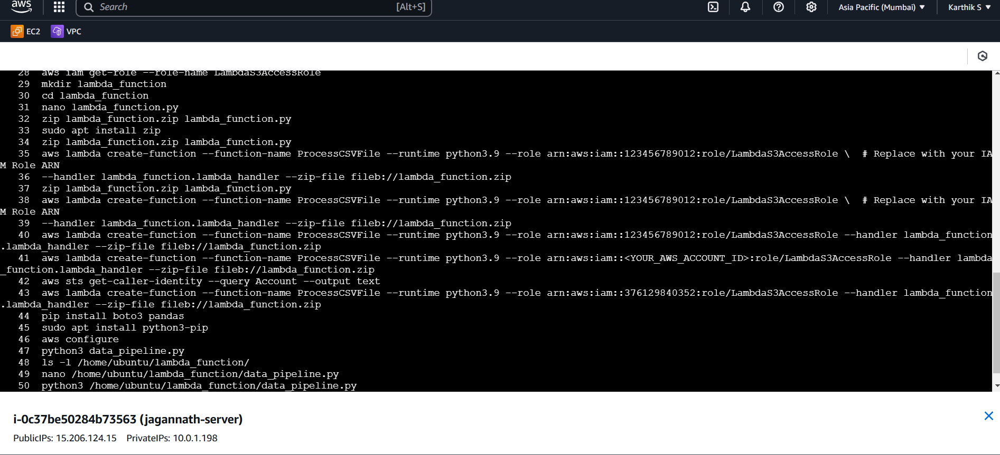

### Final Outcome
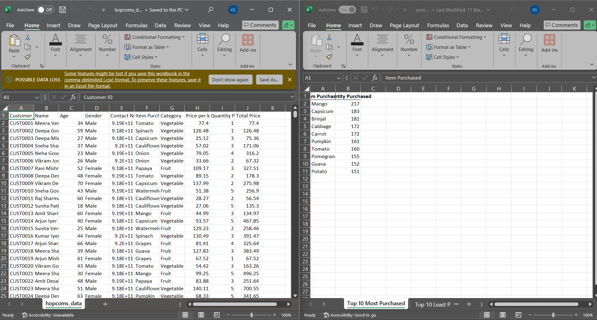

## 🔄 Implementation of the AWS Data Pipeline

### 1️⃣ Data Ingestion (Extract)
The shopkeeper collects sales data in a CSV file.
The CSV file is uploaded manually to an AWS S3 bucket.

### 2️⃣ Data Processing (Transform)
A Python script running on AWS EC2 fetches the CSV file from S3.
The data is cleaned using Pandas (removing missing values, correcting data types).

Business insights are generated:

- Top 10 most purchased items
- Top 10 least purchased items
- Total revenue per item
- Average spending per customer
- Revenue per category

### 3️⃣ Data Storage & Reporting (Load)
The processed data is saved in a structured format.
The final report is generated as an Excel file using XlsxWriter.
The processed report is uploaded back to AWS S3.

## Steps:

- 1. Creating EC2 Ubuntu instance with http and https security group
- 2. Creating S3 bucket and two folders one is Raw_data and other one is Processed_data


## 🔄 Pipeline Steps

### Step 1: Update and Install Pip

```bash
sudo apt update -y
sudo apt install python3-pip -y
```

### Step 2: Install AWS CLI

```bash
curl "https://awscli.amazonaws.com/awscli-exe-linux-x86_64.zip" -o "awscliv2.zip"
sudo apt install unzip -y
unzip awscliv2.zip
sudo ./aws/install
aws --version
```

### Step 3: Configure AWS CLI

```bash
aws configure
```

### Step 4: Install Python Packages 

```bash
sudo apt install python3-pandas python3-boto3 python3-xlsxwriter
```

### Step 5: Create virtual environment

```bash
sudo apt update
sudo apt install python3.12-venv
sudo apt install python3-venv
python3 -m venv myenv
```

### Step 6: Activate the virtual environment and install dependencies with pip

```bash
source myenv/bin/activate
pip install pandas boto3 xlsxwriter
```


### Step 5: Run the Script inside the virtual environment

```bash
python3 download_and_process.py
```

## 📁 Folder Structure

```
automated-data-pipeline/
├── download_and_process.py
├── requirements.txt
├── README.md
├── sample_data/
│   ├── hopcoms_data.csv
│   └── processed_output.xlsx
└── images/
    └── (screenshots)
```


